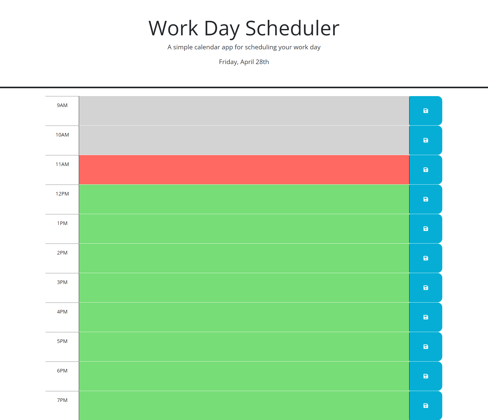

# Work Day Scheduler

## Description

The app is a work day planner.
* The current day and date is displayed on the top
* According to the current hour the timeblocks for the events change color ( gray = past , red = present , green = future)
* Everytime an event is entered in a timeblock it can be saved,
and after being saved stays on the page upon refreshing it.

## Installation

N/A

## Usage

Link to deployed app: https://oliver23n.github.io/daily-planner/

## Credits

Html and Css code developed and provided by Columbia Coding Bootcamp

js Code developed by Oliver Nasevski
https://github.com/oliver23n

## License

Refer to Repo